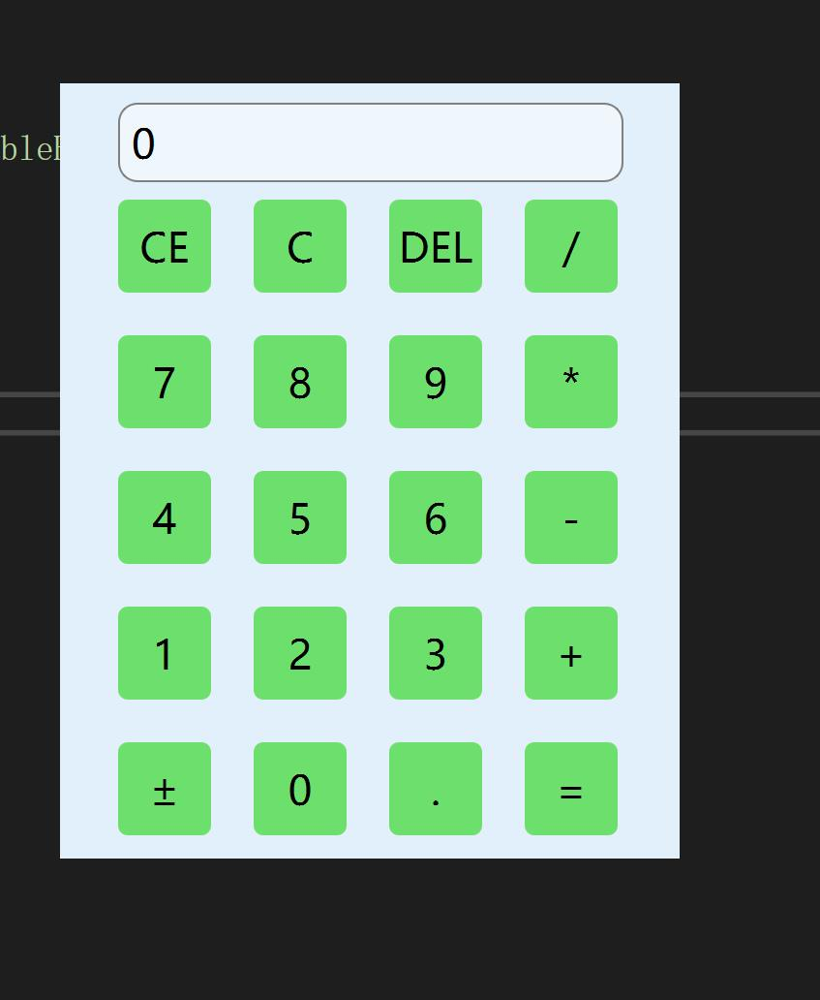

# Simple-Calculator

## 简单介绍

一个基于Qt实现的简易计算器 

项目中采用链表的数据结构实现了高精度的加减乘除四则运算

## 开发环境

### Qt Creator

### Visual Studio 2022

## 如何运行该项目

### Step1

下载好Qt Creator以及Visual Studio2022软件，并在Visual Studio2022上配置好Qt环境

### Step2

在Visual Studio2022中新建一个Qt项目，并将src文件夹下中的.h .cpp等文件复制到新建的项目中

### Step3

运行项目

## 效果呈现

